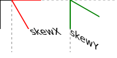
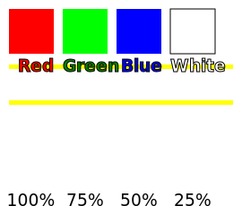

# SVG Essentials

Sample Code of SVG Essentials  

## ch01_basic

## ch02_WebSVG

## ch03_coordinates

## ch04_drawing

Standard Color:
aqua, black, blue, fuchsia
gray, green, lime, maroon
navy, olive, purple, red
silver, teal, white, yellow

SVG Extension Color:
http://www.w3.org/TR/SVG/types.html#ColorKeywords/

CSS3 Color:
http://www.w3.org/TR/css3-color/

## ch05_Dom

## ch06_transform

## ch07_arc_line

## ch08_PatternAndGradient

## ch09_text

## ch10_clip_mask

<!--

-->

## ch11_blur

## ch12_SMIL_animation

## ch13_SVG_HTML_Interactive

## ch14_SVG_DOM

